# 行星大气光学与视象图谱

> 本文用于建立基本概念，梳理大气视象。由 GPT-5.6 Sol 协助编辑整理。

> “视象”指观察者或相机最终记录的可见外观。它包括亮度、颜色、方向分布、边缘形态和随时间发生的变化。“现象”偏重物理过程，“照片”与“画面”偏重记录结果。

## 导读：先确定光怎样到达观察者

天空呈蓝色，低太阳呈暖色，地平线附近明亮，高空天顶接近黑色，行星边缘出现细亮带。这些视象都由光源、观察位置、传播路径和大气介质共同决定。在分析大气视象时，我们依次检查五项：

1. **光从哪里来**：恒星、卫星、地表、星空或大气自身发光。
2. **观察者在哪里**：地表、高空、大气外部。
3. **光走了多长路径**：天顶短程、地平线长斜程、行星边缘切线路径。
4. **路径中有什么**：气体分子、吸收气体、气溶胶、云和地表。
5. **记录过程改了什么**：镜头、传感器、曝光、白平衡、色彩变换和后期处理。

本文以可见光和地球—太阳系统为主。云微物理、降水、沙尘暴动力学、极光动力学、完整地表材质和数值求解方法不在本文展开。全文共八章。第一至三章说明共同物理关系；第四章按地表、高空和太空视角整理地球视象；第五章以火星、金星、泰坦和水星作简要对照；第六章给出读图与检查步骤；第七章汇总术语，第八章列出参考资料。

---

## 一、一条视线中有哪些光

观察者接收的是沿某个方向传播的光谱辐亮度。主要有三类光路贡献：

- **边界光**：视线终点落在地表或背景天体上，终点发出或反射的光穿过大气后到达观察者。
- **沿途散射光**：光先从恒星或地表到达大气某处，再改变方向进入观察视线。
- **沿途发射光**：大气中的原子、分子或化学过程直接产生辐射，气辉属于这一类。

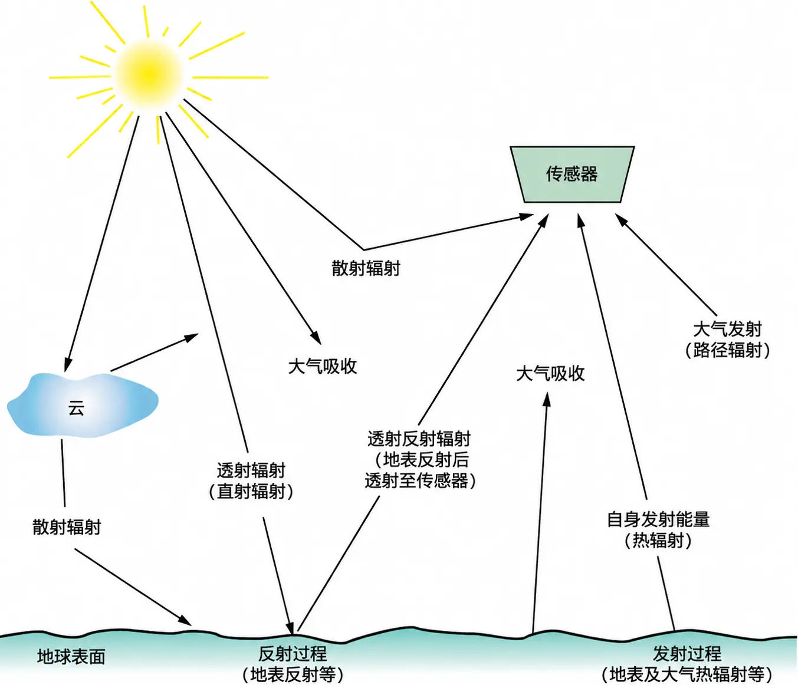

_一条视线中的辐射由边界光、沿途散射光和沿途发射光共同构成；各部分在到达观察者前还会继续受到路径透射率的影响。_

若观察者位于 $\mathbf{x}_o$ 并取路径起点 $s=0$，$\hat{\mathbf v}$ 表示从观察者指向场景的视线方向，路径上的位置为

$$
\mathbf{x}(s)=\mathbf{x}_o+s\hat{\mathbf v}
$$

视线边界位于 $s=s_b$ 时，概念上可写成：

$$
L_{\mathrm{obs}}(\lambda,\hat{\mathbf v})
=L_b(\lambda,\hat{\mathbf v})\,T(0,s_b;\lambda,\hat{\mathbf v})
+\int_0^{s_b}J(\lambda,s,\hat{\mathbf v})\,
T(0,s;\lambda,\hat{\mathbf v})\,ds
$$

其中，$\lambda$ 是波长；$s$ 是从观察者到视线边界的路径坐标；$L_{\mathrm{obs}}$ 是观察到的光谱辐亮度；$L_b$ 是地表、恒星或深空等边界提供的光；$T$ 是给定位置到观察者的直达透射率；$J$ 是沿途每单位长度散射或发射进当前视线的光。这里用 $\hat{\mathbf v}$ 标记观察方向，实际被接收的光子沿 $-\hat{\mathbf v}$ 方向传播至观察者。

这条公式把观察结果分成两部分：边界原有的光经过整段大气后的剩余，加上沿途每一点新进入视线并在余下路径继续衰减的光。对散射部分，$J$ 已概括其他入射方向的辐亮度经过相函数分配后进入当前视线的贡献；它的具体数值仍需由散射和发射过程另外求得。[1]

### 光学厚度

介质从原光束中移走光的作用称为消光。消光包括散射出原方向和吸收：

$$
\beta_e(\lambda,\mathbf{x})
=\beta_s(\lambda,\mathbf{x})
+\beta_a(\lambda,\mathbf{x})
$$

其中，$\mathbf{x}$ 是空间位置，$\beta_e$、$\beta_s$、$\beta_a$ 分别是消光、散射和吸收系数，单位通常为 $\mathrm{m^{-1}}$。

这条公式表示原光束在单位路径上的总损失由两种去向相加而成：一部分被散射出当前方向，另一部分被介质吸收。

将消光系数沿实际光路积分，可得两个路径位置 $s_1$ 与 $s_2$ 之间的光学厚度：

$$
\tau(\lambda;s_1,s_2,\hat{\mathbf v})
=\int_{s_1}^{s_2}\beta_e\!\left(\lambda,\mathbf{x}(s)\right)\,ds
$$

$\tau$ 是无量纲光学厚度，$\mathbf{x}(s)$ 由当前视线方向 $\hat{\mathbf v}$ 确定。这条公式把沿途各处不同的局地消光连续累加成整条路径的总消光尺度，因此路径更长、介质更密或消光更强都会使 $\tau$ 增大。[2]

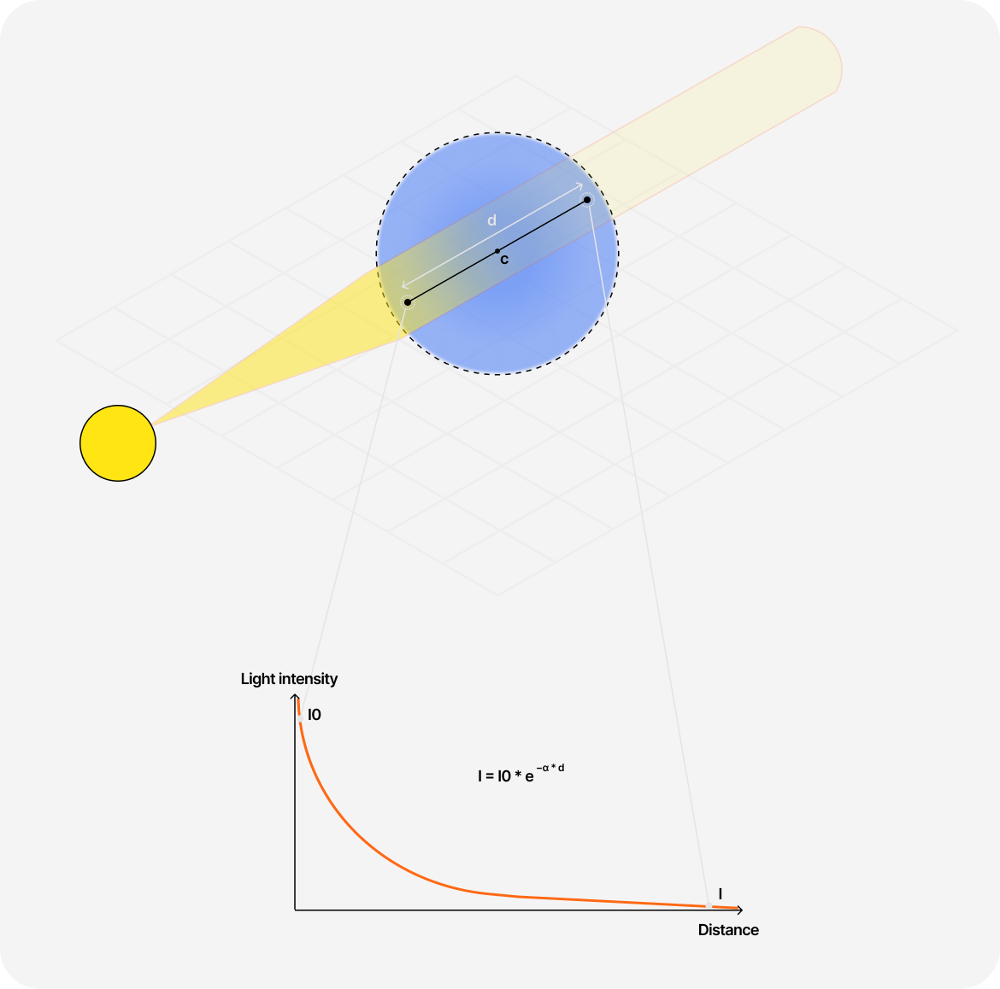

_直达光穿过介质时随光学厚度按指数规律衰减；路径越长或消光系数越大，保留在原方向的光越少。_

只看没有被散射或吸收移出原方向的直达分量时，比尔–朗伯定律（Beer–Lambert law）给出：

$$
T(s_1,s_2;\lambda,\hat{\mathbf v})
=e^{-\tau(\lambda;s_1,s_2,\hat{\mathbf v})}
$$

$T$ 是直达透射率。这条指数关系表示每一小段路径都按比例削弱尚未损失的原光束，因此各段透射率相乘、各段光学厚度相加；例如 $\tau=1$ 时约有 $1/e\approx37\%$ 的直达光保留下来。[3-4]

光学厚度和透射率只描述原方向的直达光，不等于天空总亮度，因为被散射到其他方向的光仍可能通过前式中的 $J$ 进入观察视线。

同一份大气在三个方向上会形成显著差别：

| 视线           | 路径情况           | 常见结果                             |
| -------------- | ------------------ | ------------------------------------ |
| 地表仰望天顶   | 穿过较短大气柱     | 分子散射较清楚，天空常呈较深蓝色     |
| 地表看向地平线 | 斜穿较长大气柱     | 消光和沿途散射累积，远景对比度降低   |
| 太空看行星边缘 | 近切线穿过球状大气 | 稀薄高层也能累积出可见亮带或吸收结构 |

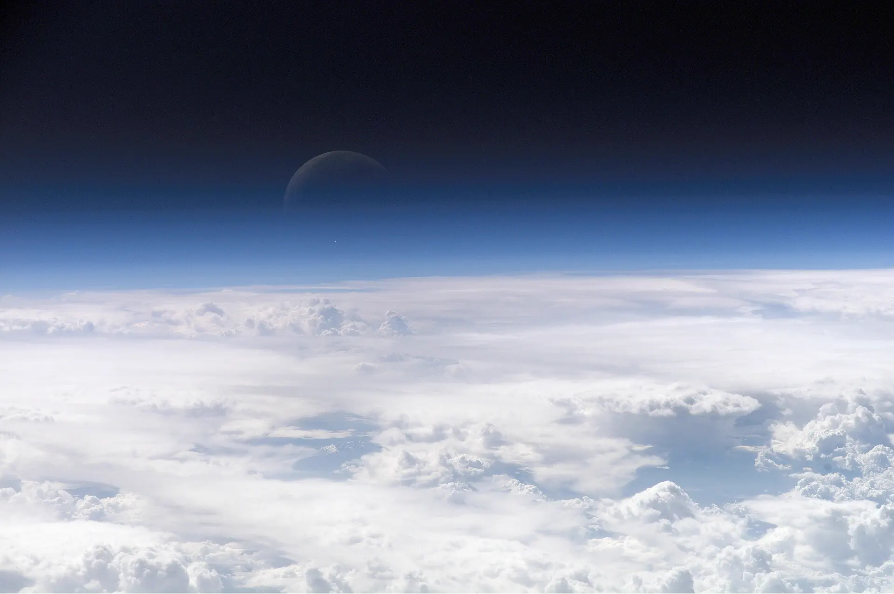

_观察者从太空沿地球边缘看去，视线在大气中传播较长距离。照片中的亮带宽度还受视距、曝光、镜头和传感器分辨率影响。_

---

## 二、决定大部分视象的四项机制

### 1. 分子散射

散射体尺度远小于波长时，散射处于瑞利散射（Rayleigh scattering）区域。在介质组成、数密度和状态固定，且远离强吸收带时，分子散射系数的主要波长趋势可写成：[5-6]

$$
\beta_R(\lambda)\propto\lambda^{-4}
$$

$\beta_R$ 是瑞利分子散射系数，$\lambda$ 是波长。这条关系表示在其他条件不变时，分子散射会随波长增大而迅速减弱，因此短波比长波更容易从原光束散射出去。

对于两个波长 $\lambda_1$ 和 $\lambda_2$，可用比值消去未写出的比例常数：

$$
\frac{\beta_R(\lambda_1)}{\beta_R(\lambda_2)}
\approx
\left(\frac{\lambda_2}{\lambda_1}\right)^4
$$

这条比值公式直接比较两个波长的分子散射强弱：波长减半时，理想瑞利散射约增强到 16 倍；它描述的是局地散射系数。

白昼天空中的蓝色来自散射进入视线的太阳光。太阳直射光中的部分短波离开原方向，其中一部分从其他方向到达观察者。

低太阳的暖色也来自这项光谱重新分配。太阳接近地平线时，直射光穿过较大的光学厚度。短波从太阳方向损失较多，剩余直射光偏向长波。蓝天和暖色低太阳由同一过程在不同方向上的结果组成。

天空亮度还受散射角、太阳高度、气溶胶、多重散射和地表反射控制。瑞利散射的波长关系不能单独确定某个方向的颜色和亮度。

分子和气溶胶在画面中的重要差别，不只在于散射强弱，还在于光被重新分配到哪些方向。下图以瑞利散射（Rayleigh scattering）与米氏散射（Mie scattering）的典型角分布作定性比较：

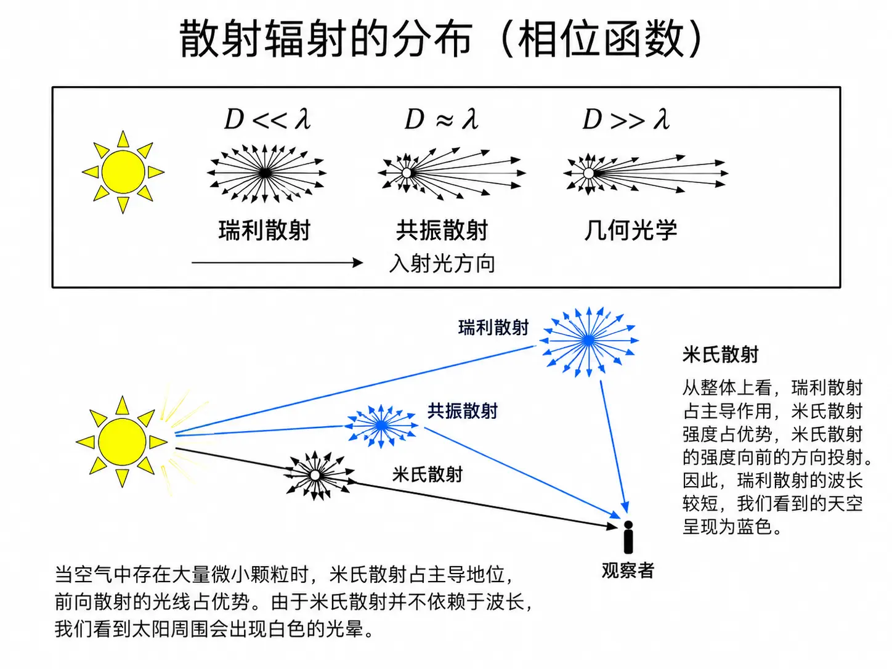

_图中以粒径 $D$ 相对波长 $\lambda$ 的大小，概括散射方向从较分散向强前向集中的变化。图中文字采用便于建立直觉的概括性标签；定量结果由粒径参数、复折射率、形状与粒径分布共同决定。_

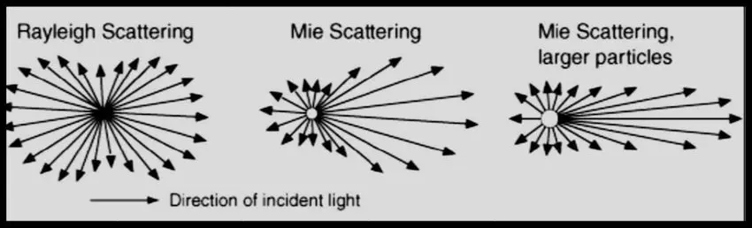

_左侧表示分子尺度散射常见的前后近似对称趋势，右侧表示粒子增大后前向散射逐渐增强。图示用于比较两个散射区域的典型方向特征；真实气溶胶相函数还受粒径分布、形状、复折射率、混合状态和波长控制。[5,7-8]_

### 2. 气溶胶

气溶胶由悬浮在气体中的固体或液体粒子构成。粒径接近或大于可见光波长时，散射常集中在前向；其光谱依赖由粒径、成分和粒径分布共同决定，不能再直接套用瑞利散射的 $\lambda^{-4}$ 关系。[7-8]

这一方向分布影响近太阳亮区、地平线灰白层次和远景对比度。判断气溶胶时，先看三项：

- **消光强度**：光束总共损失多少。
- **单次散射反照率**：消光中有多少来自散射，有多少来自吸收。
- **相函数**：散射光主要进入哪些方向。

对当前讨论的气溶胶，单次散射反照率定义为：

$$
\omega_0(\lambda)
=\frac{\beta_s(\lambda)}{\beta_e(\lambda)}
=\frac{\beta_s(\lambda)}
{\beta_s(\lambda)+\beta_a(\lambda)}
$$

$\omega_0$ 是 0 至 1 之间的无量纲比例，$\beta_s$、$\beta_a$ 分别是该气溶胶的散射和吸收系数。这条公式用散射部分除以总消光，表示从原光束移走的能量中有多大比例仍以散射光存在；$\omega_0$ 越接近 1，散射占比越高，越低则吸收越重要。[9-10]

米氏理论给出均匀球形粒子的麦克斯韦方程解。真实气溶胶可能并非球形，也包含多种粒径和成分。“米氏散射”不能概括所有雾霾、灰白天空和日落变化。[7-8]

气溶胶光学厚度增加后，日落不一定呈现饱和暖色。若散射方向和光学厚度合适，暖色层次可能增强；若消光或吸收过强，太阳与周围天空会同时变暗，色彩也可能转灰。

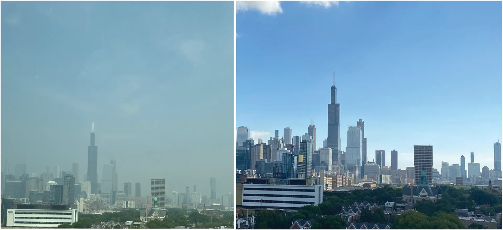

_较强的气溶胶消光和沿途散射常使天空泛白、远景对比度下降，并削弱物体的颜色差异。左右画面展示这种典型外观，同时包含拍摄时刻、湿度、云量、曝光和后期处理等观察条件。_

### 3. 光谱吸收

散射主要改变传播方向，吸收则把辐射能转入介质内部状态。气体常在特定波段产生吸收，光谱中的损失并不平滑。

若路径中有多种吸收物种，局地总吸收系数可写成：

$$
\beta_a(\lambda,\mathbf{x})
=\sum_i n_i(\mathbf{x})\,\sigma_{a,i}(\lambda)
$$

$n_i$ 是位置 $\mathbf{x}$ 处第 $i$ 种物质的数密度，$\sigma_{a,i}$ 是该物质在波长 $\lambda$ 处的吸收截面。这条公式把“有多少吸收物质”和“每个粒子在该波长有多强的吸收能力”相乘，再将所有物种的贡献相加，因此吸收光谱会同时随组分含量和物种自身的谱线结构变化。[11]

地球大气中，臭氧在紫外和可见光部分波段参与吸收，氧气和水汽也留下各自的吸收结构。日常肉眼观察中，分子与气溶胶散射通常较显眼；长斜程、暮光、掩星、凌星和大气边缘光谱中，吸收所占作用会增加。[12]

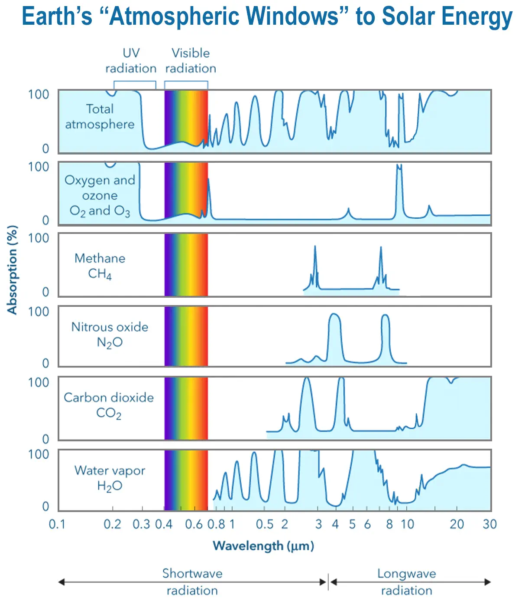

_纵轴表示吸收比例。总大气曲线中吸收较低的波段构成相对高透射的“大气窗口”，其中仍包含散射和较弱吸收。图中分别示出氧气与臭氧、甲烷、氧化亚氮、二氧化碳和水汽的典型吸收范围；实际透射率还取决于路径长度、气体柱含量、压力、温度和散射。_

若某个波段变弱，应区分散射与吸收。两者都会削弱直射光，只有散射会把其中一部分光送往其他方向。

### 4. 多重散射与地表反射

单次散射先建立方向关系：光在大气中改变一次方向后进入观察视线。真实大气还会发生第二次、第三次和更多次散射。光也可能先到达地表，反射回大气后继续传播。

多重散射能把光送入几何阴影和背日区域，也会调整亮区与暗区之间的关系。暮光、地平线、大气边缘和高反照率地表附近尤其需要考虑这项作用。

若模型缺少多重散射，常见问题不只包括整体偏暗，还包括阴影过黑、暮光衰减过快、颜色分区过硬、近地亮度关系失真。

海洋太阳闪光、雪冰和浅色沙漠会改变向上辐射。轨道观察者接收的是大气与地表共同形成的辐亮度，不能先计算纯地表颜色，再简单覆盖半透明大气色层。[1,12-13]

### 参数变化怎样影响画面

下表只给变化方向。具体结果仍取决于观察几何、波长和其他参数。

| 参数增加 | 直射光 | 散射光 | 常见画面变化 | 不能单独推出 |
| --- | --- | --- | --- | --- |
| 分子光学厚度 | 短波损失增加 | 短波贡献增加 | 直射光与天空光光谱差异加大 | 固定的蓝色或红色 |
| 气溶胶光学厚度 | 总消光增加 | 取决于散射反照率 | 远景对比度下降，近太阳区域改变 | 日落一定更红 |
| 前向散射峰 | 太阳附近贡献增加 | 其他方向未必同步增加 | 近太阳亮区更集中 | 总浑浊程度 |
| 吸收比例 | 直射光损失增加 | 可供后续散射的光减少 | 天空和太阳可能同时变暗 | 某个固定色相 |
| 地表反照率 | 地表反射增加 | 近地多重散射增加 | 阴影区和近地大气亮度变化 | 所有方向等量变亮 |

---

## 三、在特定条件下必须加入的机制

### 折射与大气色散

折射率随高度变化时，光路会弯曲。接近地平线的日月常出现在几何位置上方。圆盘下缘通常比上缘抬升得多，圆盘随之垂直压扁。强温度梯度还能产生分层、倒置和复杂形变。[14-15]

折射率也随波长变化。低空明亮天体可能出现方向相反的彩色边缘。判断大气色散前，应排除镜头色差、过曝和后期处理。[14]

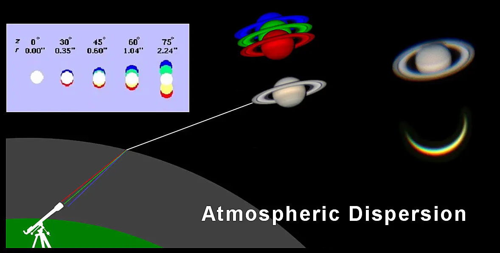

_不同波长的光经过大气后产生不同的折射角，使天体像沿近似竖直方向发生颜色分离。天体越接近地平线，穿过的大气路径越长，色散通常越明显。_

### 偏振

瑞利单次散射会形成方向相关的线偏振。本文采用的散射角指入射传播方向与散射后传播方向之间的夹角；部分领域使用其补角，比较资料时需先核对约定。单次散射角接近 $90^\circ$ 时，线偏振通常较强。[6,16-17]

普通 RGB（红、绿、蓝三通道）照片不能完整记录偏振状态。偏振镜、气溶胶、多重散射、地表和云都会改变最终明暗分布。[16-17]

### 大气自身发射

夜侧高层大气可由光化学反应和原子、分子跃迁产生气辉。切线路径会把微弱体发射累积成清晰亮层。气辉不属于太阳散射残光，也不同于高能带电粒子激发的极光。[18-19]

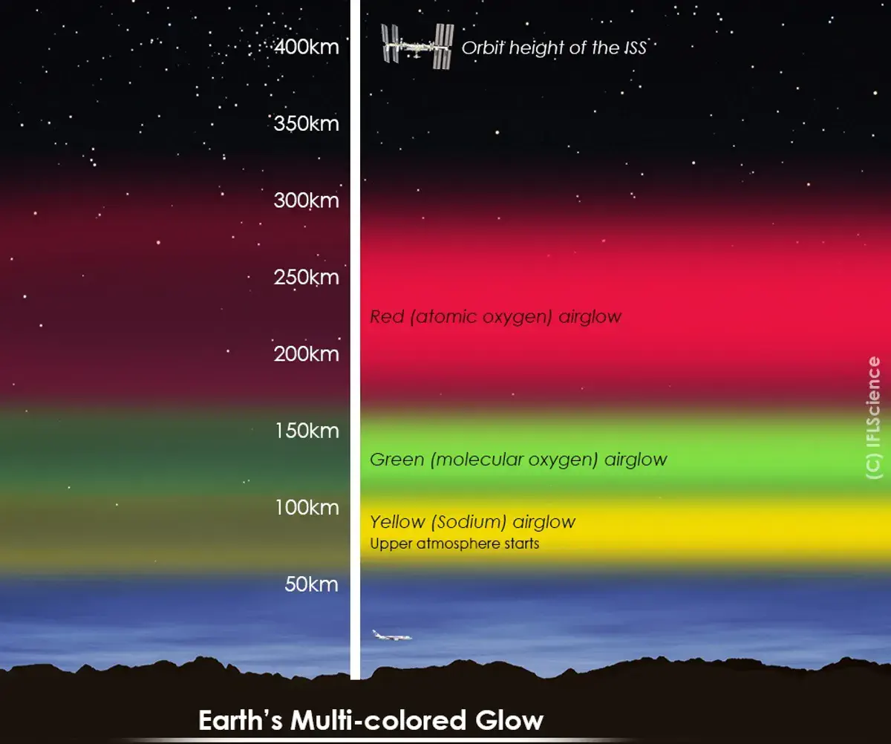

_示意图展示不同气辉发射在切线方向上形成的典型高度带：较低处可见钠层相关黄光，约 90–100 km 附近常见绿色原子氧气辉，更高处可见红色原子氧气辉。图中绿色带宜按原子氧气辉理解；各发射层具有连续的高度分布，其范围和亮度随大气状态变化。_

### 有限角尺寸的太阳与月亮

把太阳简化成单一方向，可以处理许多白昼问题。日出日落圆盘、晨昏半影和食相还需要有限角尺寸。太阳和月亮都有明确角宽；二者的相对角尺寸与遮挡比例共同决定日食的本影、半影和环食区域，月亮作为被观测圆盘时也需要逐点处理消光与折射。[20-21]

---

## 四、从地表到太空

### 1. 地表与近地观察

地表观察先确定太阳方向，再比较天顶、地平线、近太阳和背太阳方向。

#### 白昼天空

太阳较高时，天顶路径较短，天空常呈较深蓝色。接近地平线时，路径增长，气溶胶与多重散射贡献增加，天空常转为明亮的蓝白或灰白。近太阳方向还会受气溶胶前向散射影响。

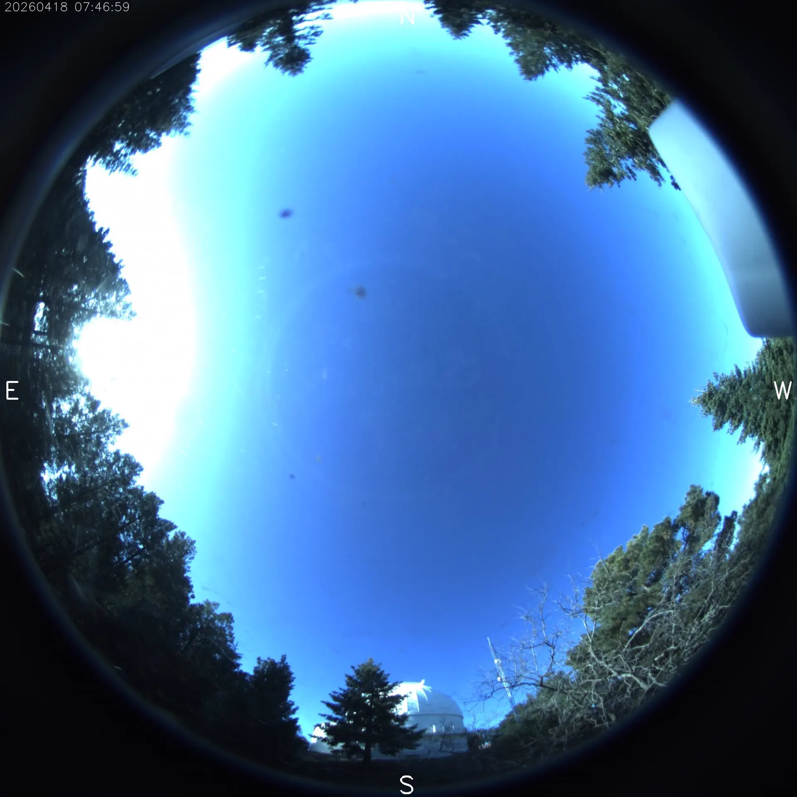

_全天空视图展示高太阳高度角下向日、背日、天顶和地平线方向的整体亮度与颜色关系。_

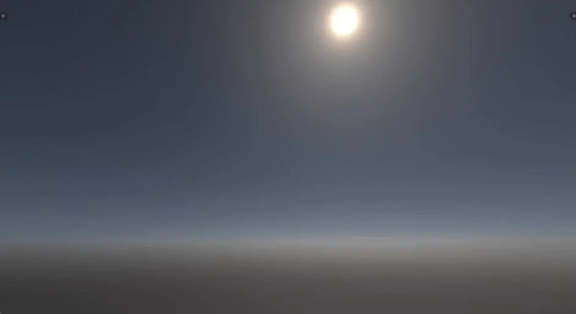

_地平线方向路径较长，天顶方向路径较短。_

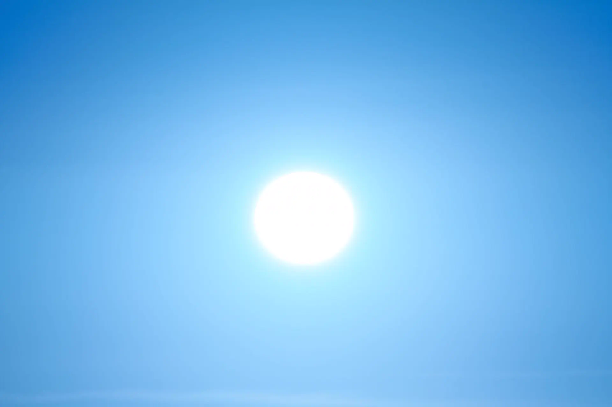

_太阳附近的亮度增强可包含气溶胶前向散射；圆盘饱和、镜头光晕和杂散光也会扩大照片中的亮区。相函数分析还需结合曝光、镜头响应与其他观察方向。_

白昼天空的检查重点：

- 天顶与地平线是否存在连续差别；
- 近太阳区域是否符合相函数方向；
- 远景对比度是否随路径增长而降低；
- 相机处理是否制造了大气中不存在的局部亮区。

#### 低太阳与日出日落

太阳降低后，直射光穿过较长大气路径。分子散射使短波从太阳方向损失较多，气溶胶继续改变消光、吸收和方向分布。多重散射维持阴影区与远离太阳方向的部分亮度。

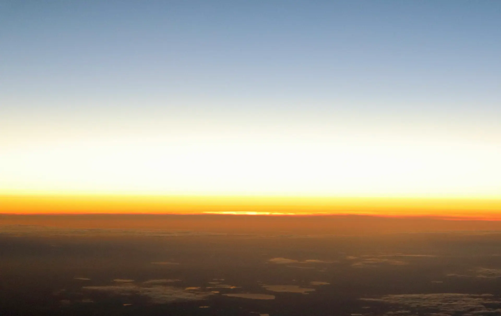

_低太阳照明放大了不同高度、路径和组分之间的差别。_

现实中的湿度、污染、烟尘和云会继续改变结果，不能压缩成单一“日落颜色”参数。

接近地平线时，折射会抬高太阳视位置并压扁圆盘。异常折射率梯度还能产生分层和 Ω 形轮廓。大气色散与异常折射共同参与绿色闪光等短暂现象。

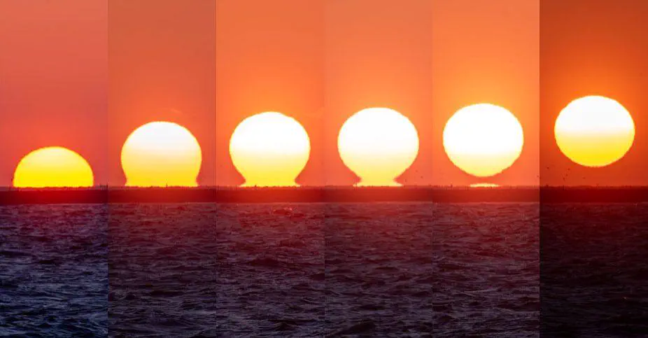

_平滑压扁可由正常分层折射产生；明显分层与 Ω 形结构通常还涉及异常折射率梯度。_

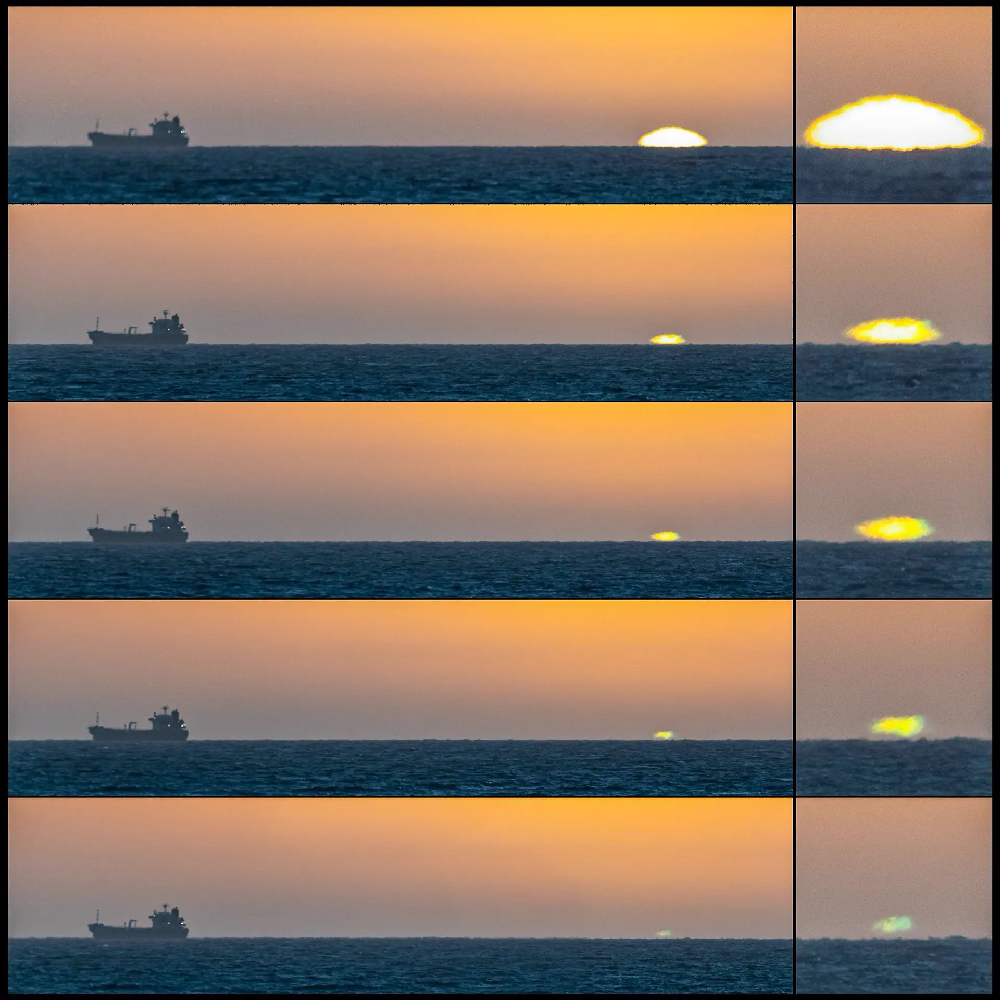

_右列放大图可见太阳圆盘上缘短暂出现的绿色亮边；其形态还受大气色散、折射率梯度和记录条件影响。_

#### 暮光、地影与维纳斯带

太阳圆盘低于地平线后，近地表可能失去直射光，高处和远处大气仍受太阳照明。太阳继续下降时，直接受光区域升高并远离观察者，多重散射占比逐渐增加。

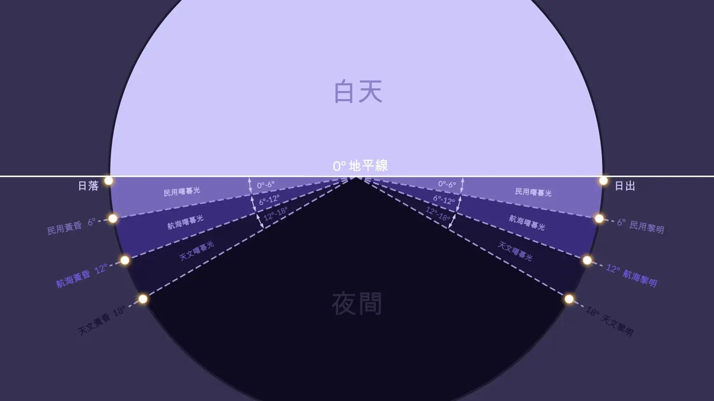

_民用、航海和天文暮光按太阳负高度角形成统一的几何分段；各阶段的实际环境照度还随大气状态、月光、地表照明与观察方向变化。_

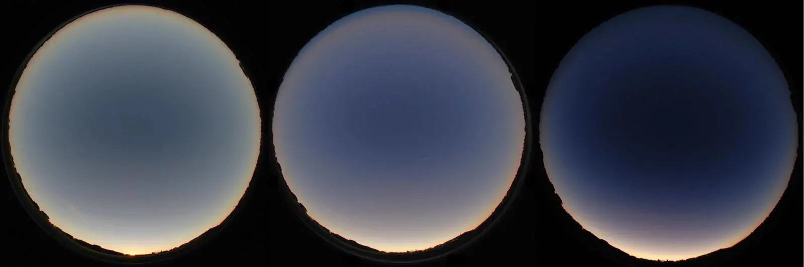

_向日、天顶和背日方向以不同速率变暗，形成随太阳高度连续演变的全天空亮度分布。_

背太阳方向常可见暗色地影，其上方可能出现粉红至紫红色维纳斯带。地影来自行星本影与大气的空间关系，维纳斯带来自仍受低太阳照明的大气及散射光。二者在大气中占有一定高度和体积，不能按平面条纹处理。

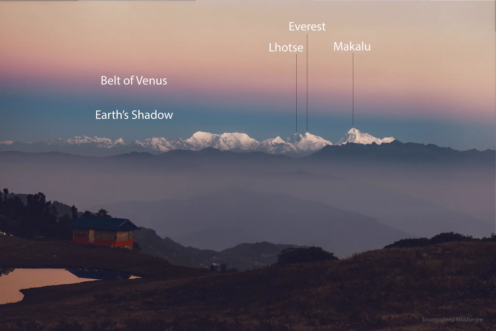

_注意图中上方受光暖色大气与下方地影的相对位置。_

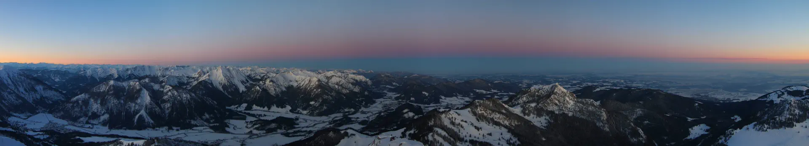

_地影与维纳斯带常在背太阳方向形成宽弧，亮度和颜色随太阳高度、大气状态与记录处理改变。_

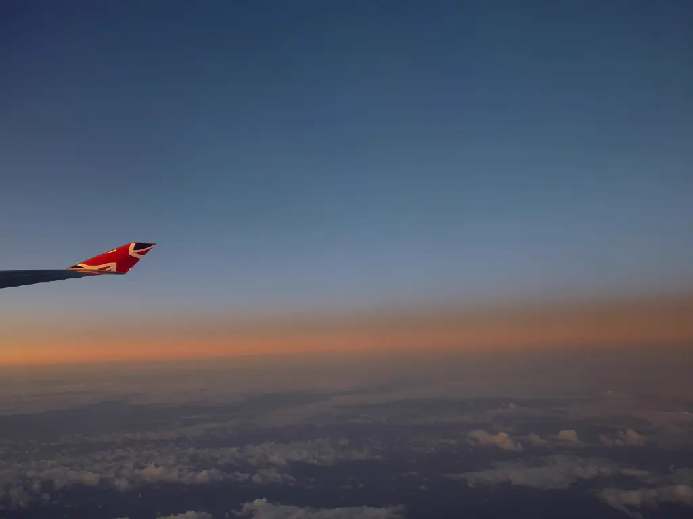

_飞行高度改变了可见地平线及各段大气路径，使背日方向的地影与上方暖色带更易分辨。_

#### 月亮、行星与恒星

背景天体的光进入大气后，也会经历消光、吸收和折射。天体接近地平线时，长路径使亮度下降，透射光谱也会改变。

不同波长的折射量略有差异，低空明亮天体可能出现上下方向相反的彩色边缘。星光闪烁还涉及湍流引发的快速折射率变化，本文不展开其统计模型。

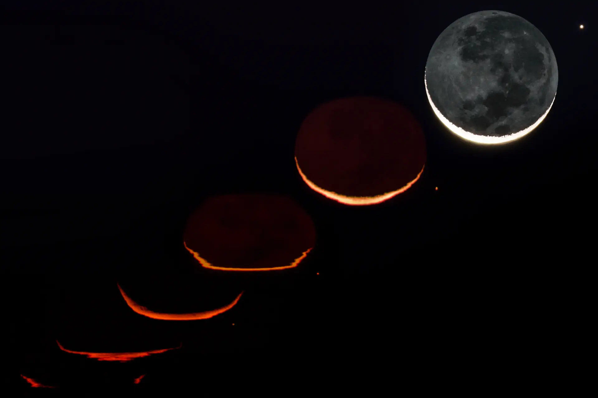

_月牙降低时，路径增长使消光增强并改变透射光谱。_

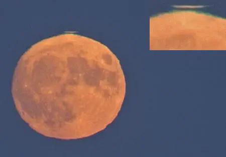

_月亮下缘通常受到较强折射抬升，圆盘因而垂直压扁。_

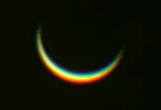

_蓝绿与橙红边缘出现在金星像的相反两侧，是低高度角下不同波长折射量不同的典型表现；实际色边还可能受镜头和图像处理影响。_

地表观察小结：先看太阳方位和视线高度，再看路径长度、气溶胶方向分布与折射。颜色放在这些条件之后判断。

### 2. 高空与近地轨道观察

从高空上升至近地轨道，关键变化不是“到达某层后天空变黑”，而是不同方向上剩余大气柱以及视线与行星边缘的关系发生变化。

#### 白昼高空

观察者升高后，头顶大气柱减少，天顶散射光减弱，天空逐渐转为深蓝并接近黑色太空背景。地平线方向仍有较长斜程，常保留明亮大气带。

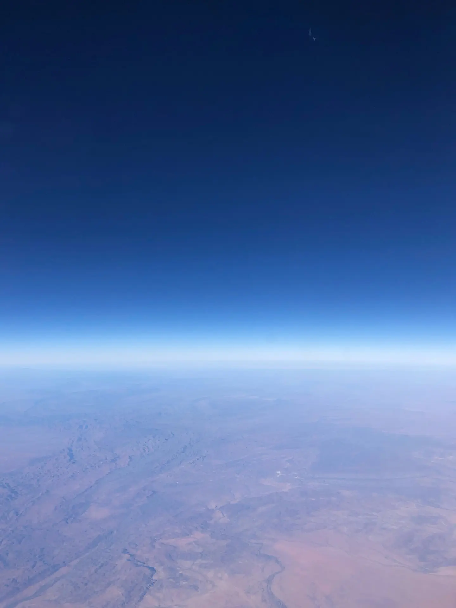

_观察高度升高后，天顶方向的剩余大气柱减少并呈现更深的天空，地平线方向仍因长斜程保持明亮。_

对流层顶等热力学分层不构成可见颜色开关。密度和光学厚度随高度连续变化，视象也随方向连续变化。

#### 高空与近地轨道的日出日落

高空观察者可同时看到受光高层、进入阴影的低层和远处地表。切线方向的长路径放大垂直组分差别，画面中可能出现暖色低层、明亮过渡层和深色高空。

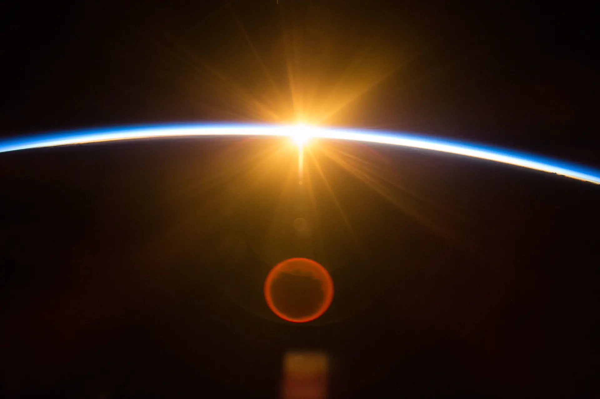

_轨道视角将低太阳照亮的长斜程大气、进入阴影的低层区域和深色太空背景同时呈现在画面中。_

可见色带不能直接对应对流层、平流层等热力学层名。层名来自温度等物理结构，颜色来自具体路径上的辐射积分。太阳方向、观察高度、组分剖面和曝光都会改变色带位置与宽度。

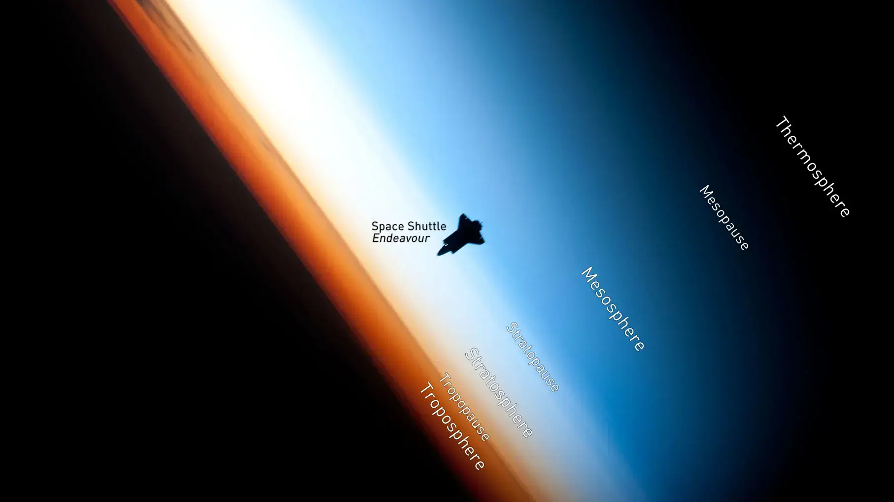

_图中文字标出若干热力学分层；可见色带来自具体光路上的辐射积分，其位置与宽度由照明、组分剖面、切线路径和曝光共同决定。_

#### 高空夜侧

高空夜景可能同时包含城市灯光、月光照亮的地表、晨昏区散射残光、星空、气辉和极光。它们在同一画面出现，但来源不同。

气辉来自高层大气中的光化学和原子、分子过程；极光主要由高能带电粒子激发。长曝光、高感光度和后期处理会显著改变两者的表观亮度。[18-19]

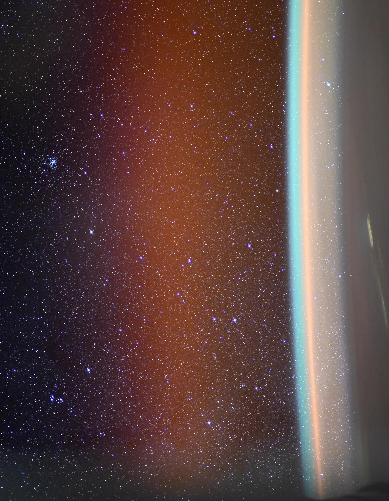

_切线路径使气辉形成细亮层。_

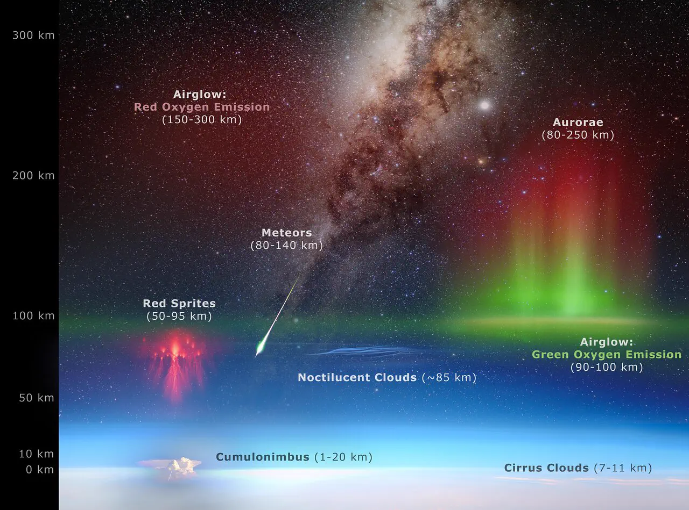

_图中并列示出气辉、极光、红色精灵、夜光云和流星等现象的典型高度范围；实际高度会随具体过程和观测条件变化。_

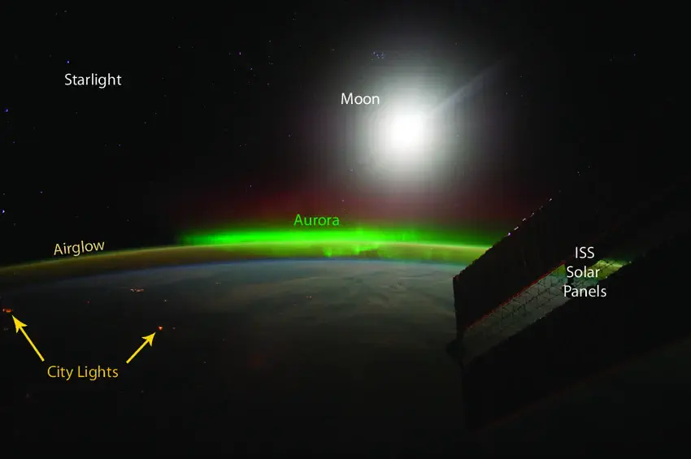

_极光可与气辉、城市灯光和星空同时出现。_

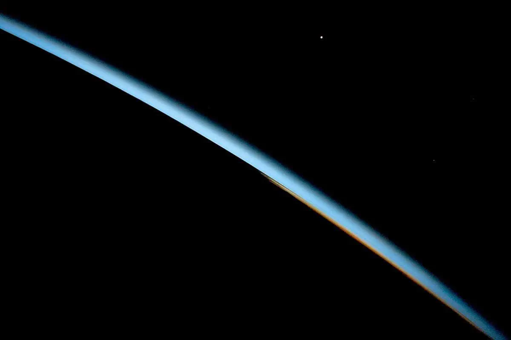

_蓝色与橙色薄层在地球边缘相邻出现；其具体来源可结合发射谱线、切线高度、照明状态和相机波段进一步判断。_

高空观察小结：先比较天顶与地平线剩余大气柱，再区分白昼散射、暮光残光、大气发射和记录处理。

### 3. 从大气外部观察行星

#### 向阳侧行星盘

照明地表的入射光先经过下行大气，形成地表反射后再沿上行路径穿过大气到达观察者。大气散射也会直接进入视线。最终辐亮度包含地表和大气共同贡献。

海洋太阳闪光、雪冰、沙漠和云会改变向上辐射。接近行星轮廓时，视线倾斜，路径增长，大气对地表对比度和颜色的影响也会增加。

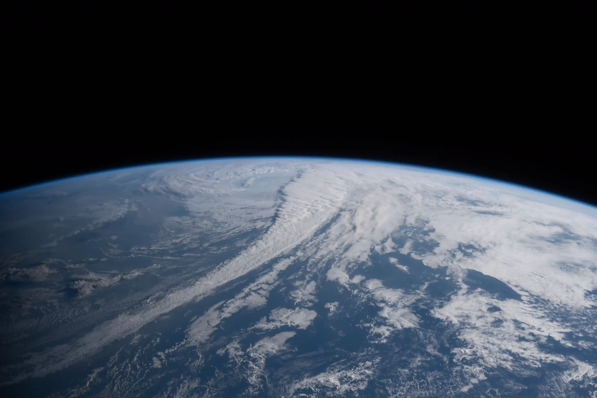

_远距离观察时，大气相对行星半径较薄，常形成贴近轮廓的连续亮边。_

#### 白昼大气边缘

大气边缘指从大气外沿近切线方向看到的区域。切线长路径放大分子散射、气溶胶散射、吸收和垂直剖面差别。太阳方向、散射角和地表反射共同改变各处亮度。

高太阳照明下，白昼边缘通常以贴近行星轮廓的蓝白薄带为主，并向太空方向连续减弱。低太阳或接近晨昏线时，长路径消光才可能进一步产生低层暖色与蓝白过渡。这些颜色随照明、组分和记录条件变化，不对应固定层名，也不应形成硬分段。

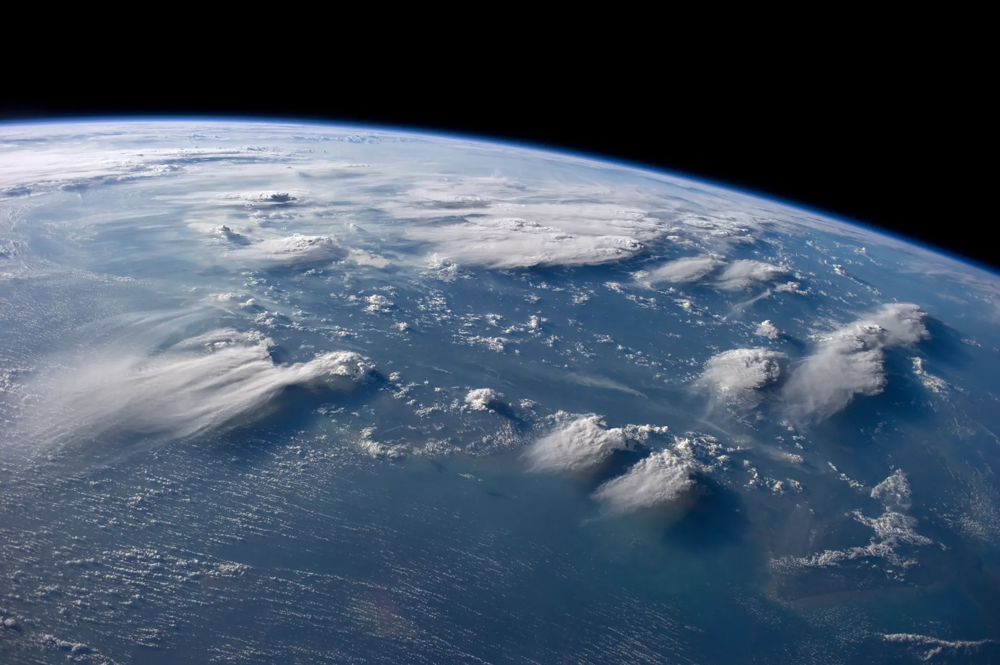

_高太阳照明下，大气主要表现为沿行星轮廓延伸的蓝白薄边。云层和地表构成明亮背景。_

照片中的边缘宽度受行星尺度、观察距离、视场角、传感器点扩散、曝光、压缩和锐化影响，不能直接等同于散射层或发射层厚度。

#### 晨昏线、新月形行星与夜侧边缘

从太空看，地表昼夜分界、大气中仍受太阳照明的体积和行星轮廓共同形成晨昏视象。有限太阳圆盘使过渡具有宽度。不同高度看到的太阳遮挡比例也不同。

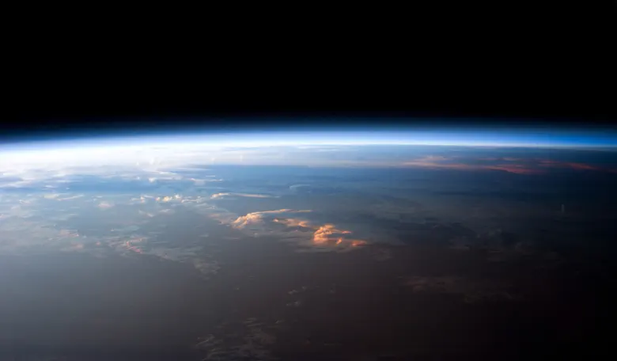

_地表已经进入夜侧时，高层大气仍可能受光。_

太阳接近行星后方时，受光大气可在暗面边缘形成细弧。进入夜侧后，散射残光减弱，月光、气辉、极光和地表主动发光仍可能进入观察视线。

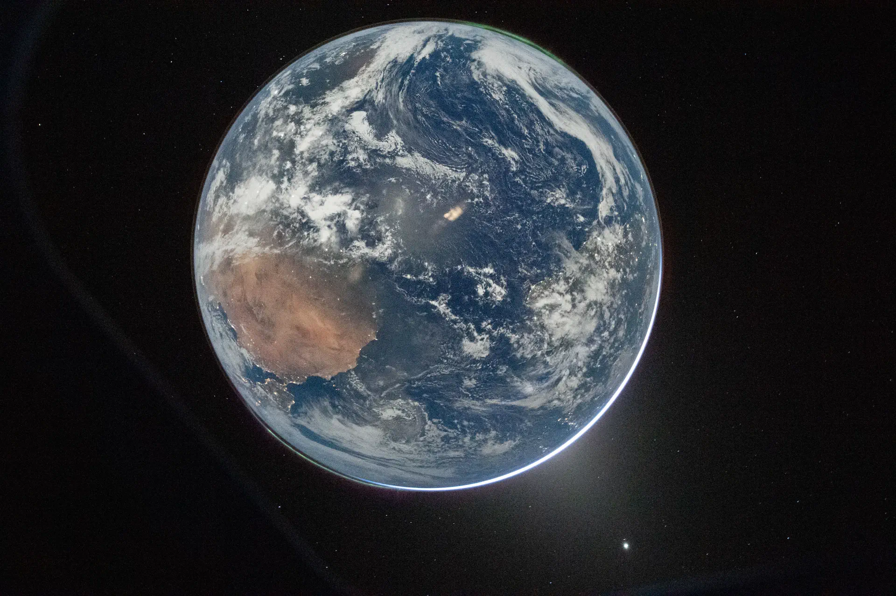

_夜侧行星边缘仍可见受光高层大气形成的细弧，暗面同时记录地表发光与低亮度大气成分。_

#### 掩星与凌星

背景恒星光沿行星边缘穿过大气时，不同切线高度对应不同组分柱含量。分子散射、气溶胶消光和气体吸收共同改变透射光谱，折射还会弯曲光路并改变接收亮度。

在这里，光谱吸收成为核心信息。研究者根据各波段透射差别反推大气组分和垂直结构。系外行星凌星通常不能获得空间分辨结果，需要从恒星整体亮度随波长发生的细小变化中提取信号。

#### 日食与月食

食相先由有限光源与遮挡几何决定。日食期间，太阳圆盘部分或全部受月球遮挡，本影与半影使地表和大气照明连续变化。[20-21]

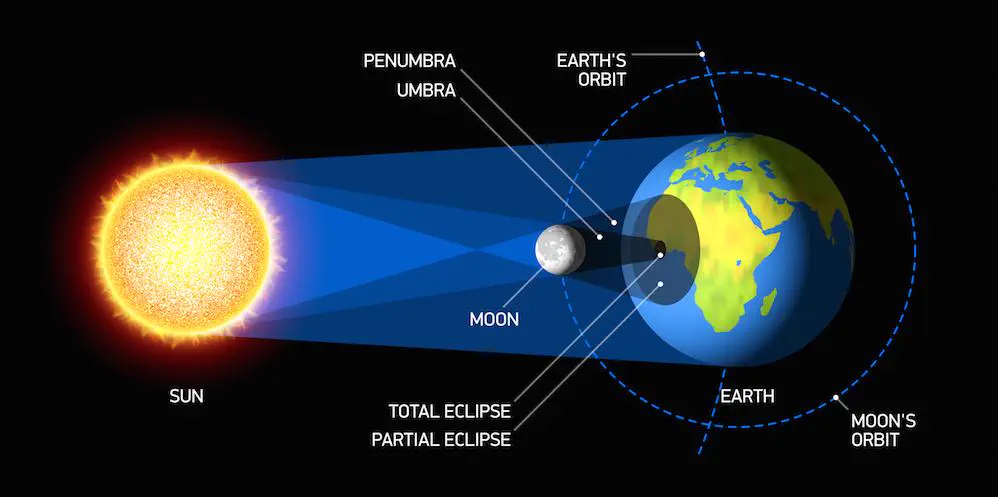

_有限太阳圆盘与月球遮挡共同形成本影和半影，使到达地表与大气的直射光随位置连续变化。_

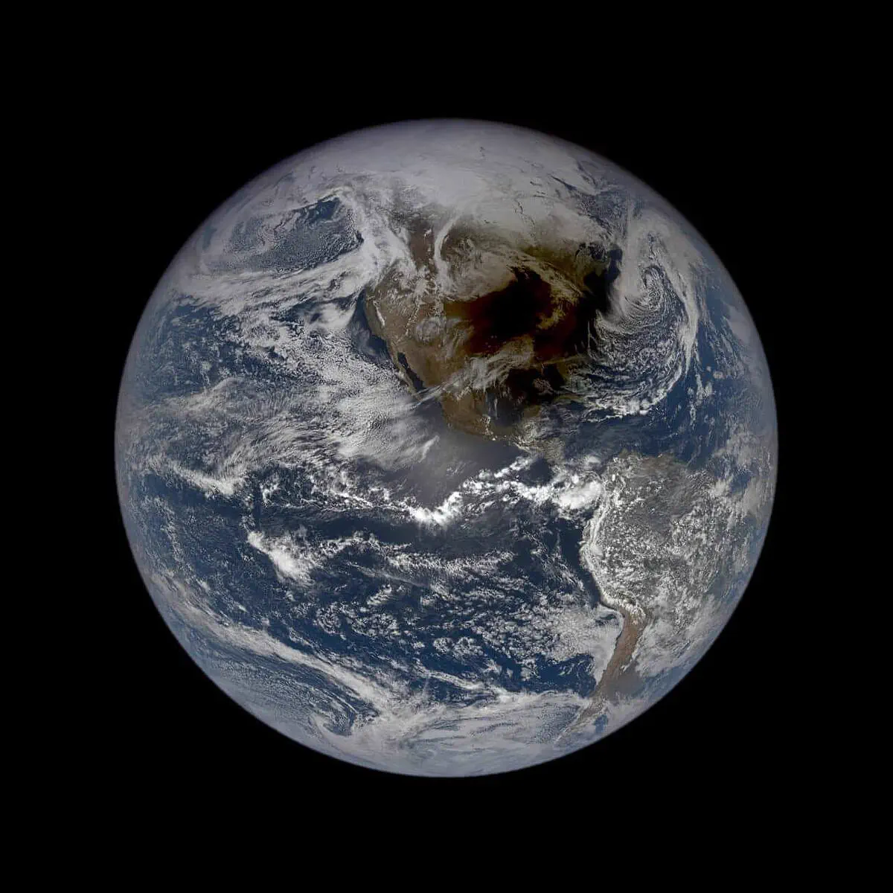

_月影出现在同时含云、地表反照和大气散射的行星盘上。_

月食期间，部分太阳光沿地球边缘传播并折射进入本影。长斜程使短波受到较强散射消光，吸收和气溶胶继续改变剩余光谱。抵达月面的光来自多条切线高度、组分和天气状态各不相同的路径。

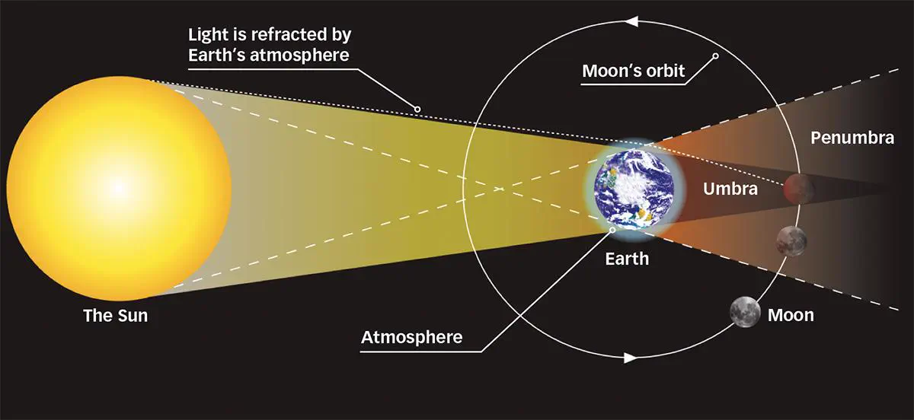

_太阳光沿地球边缘的多条切线路径传播，经大气折射与消光后进入本影并照亮月面。_

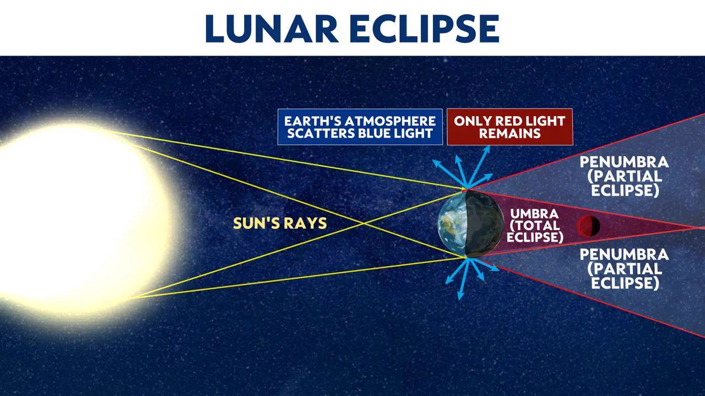

_长斜程传播使透射光谱向暖色方向偏移，散射、吸收、气溶胶和折射路径共同决定月面接收到的颜色与亮度。_

太空观察小结：先确定视线终点，再检查切线高度、太阳相位、地表贡献和传感器波段。边缘颜色与宽度均不能脱离这些条件判断。

---

## 五、同一方法怎样用于其他行星

通用的是光学厚度、辐射传输和观察几何。具体颜色取决于大气组分、压力、粒子、云、地表和传感器。地球颜色不能直接移到其他行星。[22]

### 火星：尘埃控制可见天空

火星大气稀薄，主要成分是二氧化碳，可见天空常受悬浮尘埃控制。细尘的吸收和方向散射使白昼天空常呈黄褐至红褐色，低太阳附近可出现蓝灰色亮区。NASA 的火星车资料还显示，尘埃含量和白平衡处理会显著改变记录结果。[23-24]

分析火星视象时，检查尘埃光学厚度、粒径、太阳方向、相机滤光片和颜色校准。

### 金星：厚大气和全球云层

金星大气主要由二氧化碳组成，表面压强约为地球海平面的 93 倍，并覆盖浓厚硫酸云。云层强烈散射太阳光，多次散射在可见外观中占重要位置。地球晴空中的天顶—地平线关系不能直接用于金星云下或云顶视角。[25-26]

分析金星视象时，需要区分云顶反射、云内传输、云下漫射光、气体吸收和红外波段的高温表面热发射。不同波段看到的结构也不同。

### 泰坦：浓厚大气与有机霾

泰坦大气以氮气为主，并含甲烷。高层光化学反应产生复杂有机物和浓厚橙色霾层。可见光从太空观察时，霾会削弱地表对比；部分可见光以外的波段能穿透霾层，提供更多地表信息。[27-28]

分析泰坦视象时，需要同时检查霾的吸收、散射、垂直分布、观察波段和地表反射。

### 水星：近乎没有大气散射

水星没有可与地球相比的稠密大气，只有极稀薄的外逸层，因而不能形成地球式体积天空光。若观察者站在水星表面，未被太阳和地表照亮的天空背景接近黑色。地表反射、太阳直射、镜头杂散光和传感器动态范围仍会改变画面。[29]

缺少足够介质后，天顶与地平线不会形成地球式连续天空亮度。

| 对象     | 主要介质                   | 可见光主导问题             | 地球经验失效处         |
| -------- | -------------------------- | -------------------------- | ---------------------- |
| 地球晴空 | 氮氧分子、气溶胶、吸收气体 | 分子散射、气溶胶、多重散射 | 用作对照基准           |
| 火星     | 稀薄二氧化碳大气、尘埃     | 尘埃吸收和方向散射         | 低太阳附近颜色关系不同 |
| 金星     | 厚二氧化碳大气、硫酸云     | 云层散射、多重散射、吸收   | 不能按清洁分子大气分析 |
| 泰坦     | 氮气、甲烷、有机霾         | 霾吸收、散射和波段窗口     | 可见光难以直接看清地表 |
| 水星     | 稀薄外逸层                 | 大气散射近乎缺失           | 没有地球式天空光       |

---

## 六、读图与检查步骤

面对照片、观测数据或实时渲染结果，可按下表检查：

| 步骤 | 要确认的内容 | 常见错误 |
| --- | --- | --- |
| 1. 光源与遮挡 | 恒星、卫星、地表或大气发光；有限圆盘；地形与天体遮挡 | 把所有亮度归到太阳直射 |
| 2. 观察位置 | 地表、高空或太空；视线终点是地表、天体还是深空 | 忽略观察高度与视线终点 |
| 3. 几何方向 | 天顶、地平线、近太阳、背太阳、切线高度和散射角 | 使用均匀天空颜色 |
| 4. 路径介质 | 分子、吸收气体、气溶胶、云和垂直分布 | 只调颜色，不检查光学厚度 |
| 5. 光的去向 | 透射、散射出视线、散射入视线、吸收和自身发射 | 把散射与吸收混写 |
| 6. 散射次数 | 单次散射是否足够；阴影和长路径是否需要多重散射 | 阴影过黑，暮光衰减过快 |
| 7. 地表作用 | 反照率、方向反射和太阳闪光 | 把地表与大气分成互不作用的图层 |
| 8. 记录过程 | 波段、曝光、白平衡、动态范围、镜头和后期 | 把光晕、伪色和锐化边缘写入大气物理 |

还需保留四条限制：

- 单张 RGB 照片不能给出完整光谱与偏振信息。
- 未知曝光和白平衡时，不能用照片确定绝对颜色与辐亮度。
- 画面中的边缘宽度不能直接换算成物理层厚度。
- 主导亮区、暗区和色带应随方向、高度和时间连续变化；若出现无物理原因的硬分界，应检查模型和记录处理。

---

## 七、术语表

| 中文             | 英文                     | 本文含义                                         |
| ---------------- | ------------------------ | ------------------------------------------------ |
| 辐亮度           | Radiance                 | 单位投影面积、单位立体角内沿给定方向传播的辐射功率 |
| 光谱辐亮度       | Spectral Radiance        | 按波长或频率分布的辐亮度                         |
| 辐射传输         | Radiative Transfer       | 辐射沿路径受到吸收、散射和发射共同改变的过程     |
| 辐照度           | Irradiance               | 单位面积接收的辐射功率；由入射辐亮度在入射半球按方向余弦加权积分 |
| 散射             | Scattering               | 光与介质作用后改变传播方向，也可能改变偏振或波长 |
| 散射系数         | Scattering Coefficient   | 单位路径长度上由散射造成的原光束衰减             |
| 吸收             | Absorption               | 辐射能转入介质内部状态                           |
| 吸收系数         | Absorption Coefficient   | 单位路径长度上由吸收造成的原光束衰减             |
| 吸收截面         | Absorption Cross Section | 单个粒子在给定波长上的有效吸收面积               |
| 消光             | Extinction               | 散射出原方向与吸收共同移走原光束中的光           |
| 消光系数         | Extinction Coefficient   | 单位路径长度上的消光强度                         |
| 光学厚度         | Optical Depth            | 消光系数沿路径的积分                             |
| 透射率           | Transmittance            | 光沿给定路径传播后仍保留在原方向的比例           |
| 比尔–朗伯定律    | Beer–Lambert Law         | 直达透射率随光学厚度按指数规律衰减               |
| 单次散射反照率   | Single-Scattering Albedo | 散射系数与消光系数之比                           |
| 相函数           | Phase Function           | 散射光随方向的角分布；全立体角积分可归一化为 1 或 $4\pi$，比较资料前需核对约定 |
| 瑞利散射         | Rayleigh Scattering      | 散射体远小于波长时的散射区域                     |
| 米氏散射         | Mie Scattering           | 均匀球形粒子的麦克斯韦方程解                     |
| 气溶胶           | Aerosol                  | 悬浮在气体中的固体或液体粒子系统                 |
| 多重散射         | Multiple Scattering      | 光在到达观察者前发生两次或更多次散射             |
| 折射             | Refraction               | 折射率随空间变化引发光路弯曲                     |
| 大气色散         | Atmospheric Dispersion   | 折射率随波长变化形成的角度分离                   |
| 偏振             | Polarization             | 电磁波振动方向的统计状态                         |
| 反照率           | Albedo                   | 表面对入射辐射的反射比例；使用时需说明光谱范围、方向条件及半球积分定义 |
| 双向反射分布函数 | BRDF                     | 表面从给定入射方向向给定出射方向反射光的分布     |
| 天顶             | Zenith                   | 观察者局部竖直向上方向                           |
| 地平线           | Horizon                  | 地面或行星表面与天空的几何边界                   |
| 太阳高度角       | Solar Elevation Angle    | 太阳方向高于局部地平面的角度                     |
| 散射角           | Scattering Angle         | 本文指入射传播方向与散射后传播方向之间的夹角     |
| 大气边缘         | Atmospheric Limb         | 从大气外沿近切线方向看到的行星大气区域           |
| 边缘辉光         | Limb Glow                | 切线长路径累积形成的散射或发射亮带               |
| 晨昏线           | Terminator               | 行星受恒星直接照明区与几何夜侧之间的边界         |
| 暮光             | Twilight                 | 恒星接近地平线或位于地平线下时形成的过渡照明     |
| 地影             | Earth’s Shadow           | 背太阳方向可见的地球本影在大气中的空间区域       |
| 维纳斯带         | Belt of Venus            | 地影上方常见的粉红至紫红色背日暮光带             |
| 气辉             | Airglow                  | 高层大气由光化学与原子、分子过程产生的弥散发光   |
| 极光             | Aurora                   | 高能带电粒子激发高层大气形成的发光               |
| 掩星             | Stellar Occultation      | 背景天体光沿行星边缘穿过大气的观测几何           |
| 凌星             | Transit                  | 天体从明亮背景天体前方经过的观测几何             |
| 本影             | Umbra                    | 有限光源受到完全遮挡的区域                       |
| 半影             | Penumbra                 | 有限光源受到部分遮挡的区域                       |
| 尺度高度         | Scale Height             | 理想指数分布中，密度相对起始值降至约 37% 所对应的高度增量 |

---

## 八、参考资料

- [1] Wikipedia contributors. [Radiative transfer](https://en.wikipedia.org/wiki/Radiative_transfer)[EB/OL]. Wikipedia, The Free Encyclopedia.
- [2] Wikipedia contributors. [Optical depth](https://en.wikipedia.org/wiki/Optical_depth)[EB/OL]. Wikipedia, The Free Encyclopedia.
- [3] Wikipedia contributors. [Beer–Lambert law](https://en.wikipedia.org/wiki/Beer%E2%80%93Lambert_law)[EB/OL]. Wikipedia, The Free Encyclopedia.
- [4] University Corporation for Atmospheric Research. [Instrumentation and Measurement of Atmospheric Radiation](https://www.meted.ucar.edu/instrumentation/radiation/print.php)[EB/OL]. MetEd.
- [5] Wikipedia contributors. [Rayleigh scattering](https://en.wikipedia.org/wiki/Rayleigh_scattering)[EB/OL]. Wikipedia, The Free Encyclopedia.
- [6] NASA Goddard Space Flight Center. [Rayleigh Scattering](https://acd-ext.gsfc.nasa.gov/anonftp/acd/daac_ozone/Lecture4/Text/Lecture_4/rayleigh.html)[EB/OL].
- [7] Wikipedia contributors. [Mie scattering](https://en.wikipedia.org/wiki/Mie_scattering)[EB/OL]. Wikipedia, The Free Encyclopedia.
- [8] NASA Goddard Space Flight Center. [Rayleigh Scattering and Mie Scattering](https://acd-ext.gsfc.nasa.gov/anonftp/acd/daac_ozone/Lecture4/Text/Lecture_4/raymie.html)[EB/OL].
- [9] Wikipedia contributors. [Single-scattering albedo](https://en.wikipedia.org/wiki/Single-scattering_albedo)[EB/OL]. Wikipedia, The Free Encyclopedia.
- [10] NOAA Global Monitoring Laboratory. [Aerosol Optical Terms](https://gml.noaa.gov/grad/about/aero_term.html)[EB/OL].
- [11] Wikipedia contributors. [Absorption cross section](https://en.wikipedia.org/wiki/Absorption_cross_section)[EB/OL]. Wikipedia, The Free Encyclopedia.
- [12] MOBLEY C D, WERDELL J, FRANZ B, et al. [Atmospheric Correction for Satellite Ocean Color Radiometry](https://ntrs.nasa.gov/search.jsp?R=20160011399)[R/OL]. Greenbelt: NASA Goddard Space Flight Center, 2016. NASA/TM-2016-217551.
- [13] Wikipedia contributors. [Bidirectional reflectance distribution function](https://en.wikipedia.org/wiki/Bidirectional_reflectance_distribution_function)[EB/OL]. Wikipedia, The Free Encyclopedia.
- [14] Wikipedia contributors. [Atmospheric refraction](https://en.wikipedia.org/wiki/Atmospheric_refraction)[EB/OL]. Wikipedia, The Free Encyclopedia.
- [15] NOAA Global Monitoring Laboratory. [Solar Calculator Glossary](https://www.gml.noaa.gov/grad/solcalc/glossary.html)[EB/OL].
- [16] Wikipedia contributors. [Polarization](https://en.wikipedia.org/wiki/Polarization_%28waves%29)[EB/OL]. Wikipedia, The Free Encyclopedia.
- [17] Wikipedia contributors. [Rayleigh sky model](https://en.wikipedia.org/wiki/Rayleigh_sky_model)[EB/OL]. Wikipedia, The Free Encyclopedia.
- [18] Wikipedia contributors. [Airglow](https://en.wikipedia.org/wiki/Airglow)[EB/OL]. Wikipedia, The Free Encyclopedia.
- [19] National Aeronautics and Space Administration. [Earth Enveloped in Airglow](https://www.nasa.gov/image-article/earth-enveloped-airglow/)[EB/OL].
- [20] Wikipedia contributors. [Angular diameter](https://en.wikipedia.org/wiki/Angular_diameter)[EB/OL]. Wikipedia, The Free Encyclopedia.
- [21] Wikipedia contributors. [Umbra, penumbra and antumbra](https://en.wikipedia.org/wiki/Umbra,_penumbra_and_antumbra)[EB/OL]. Wikipedia, The Free Encyclopedia.
- [22] NASA Goddard Space Flight Center. [Planetary Spectrum Generator: Atmospheric Parameters](https://psg.gsfc.nasa.gov/helpatm.php)[EB/OL].
- [23] NASA Science Editorial Team. [What Do Sunrises and Sunsets Look Like on Mars?](https://science.nasa.gov/solar-system/planets/mars/what-does-a-sunrise-sunset-look-like-on-mars/)[EB/OL]. 2019-05-01.
- [24] National Aeronautics and Space Administration. [Mars: Facts](https://science.nasa.gov/mars/facts/)[EB/OL].
- [25] National Aeronautics and Space Administration. [Venus: Facts](https://science.nasa.gov/venus/venus-facts/)[EB/OL].
- [26] HANSEN J E, ARKING A. [Clouds of Venus: Evidence for Their Nature](https://www.giss.nasa.gov/pubs/abs/ha02410v.html)[J/OL]. Science, 1971, 171: 669-672. DOI: 10.1126/science.171.3972.669.
- [27] National Aeronautics and Space Administration. [Titan: Facts](https://science.nasa.gov/saturn/moons/titan/facts/)[EB/OL].
- [28] VOROBETS M V. [The Titan Haze Simulation Experiment on COSmIC](https://www.nasa.gov/general/the-titan-haze-simulation-experiment-on-cosmic/)[EB/OL]. National Aeronautics and Space Administration, 2020-08-11.
- [29] National Aeronautics and Space Administration. [Mercury: Facts](https://science.nasa.gov/mercury/facts/)[EB/OL].
